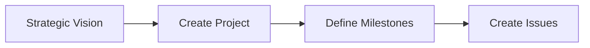
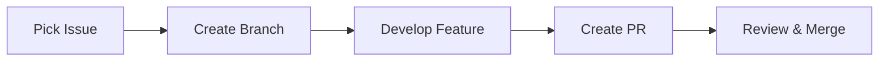
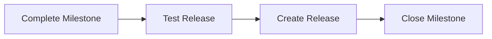

# MLOX GitHub Workflow Quick Reference

## 🚀 Quick Start Guide

### For New Contributors
1. **Read** [CONTRIBUTING.md](../CONTRIBUTING.md)
2. **Browse** [Issues](https://github.com/BusySloths/mlox/issues) with `good-first-issue` label
3. **Check** [Projects](https://github.com/BusySloths/mlox/projects) for current priorities
4. **Ask** questions in [Discussions](https://github.com/BusySloths/mlox/discussions)

### For Creating Issues
1. **Choose** the right template:
   - 🐛 [Bug Report](.github/ISSUE_TEMPLATE/bug_report.md)
   - ✨ [Feature Request](.github/ISSUE_TEMPLATE/feature_request.md)
   - 💡 [Enhancement](.github/ISSUE_TEMPLATE/enhancement.md)
   - 📚 [Documentation](.github/ISSUE_TEMPLATE/documentation.md)

2. **Apply** appropriate labels (see [Labels Guide](LABELS.md))
3. **Assign** to relevant milestone and project

## 📋 Project Hierarchy

```
🏗️ GitHub Projects (Strategic Areas)
    ├── 📊 Milestones (Releases)
    │   ├── 🎯 Issues (Tasks)
    │   │   └── 🔄 Pull Requests (Implementation)
    │   └── 🎯 Issues (Tasks)
    │       └── 🔄 Pull Requests (Implementation)
    └── 📊 Milestones (Releases)
        └── ...
```

## 🏗️ Current GitHub Projects

| Project | Description | Status |
|---------|-------------|--------|
| 🏗️ Infrastructure Core | Server management, networking | Active |
| 🔧 Services & Integrations | MLOps services, Docker/K8s | Active |
| 🎯 User Experience | CLI, Web UI, onboarding | Active |
| 🔒 Security & Configuration | Auth, secrets, config | Active |
| 📊 Monitoring & Observability | Logging, metrics, tracing | Active |
| 🚀 Community & Growth | Docs, tutorials, community | Active |

## 🏷️ Essential Labels

### Type (Required)
- `type:bug` - Something broken
- `type:feature` - New functionality  
- `type:enhancement` - Improvement to existing feature
- `type:documentation` - Documentation changes

### Priority
- `priority:critical` - Urgent, blocking
- `priority:high` - Important
- `priority:medium` - Standard
- `priority:low` - Nice-to-have

### For New Contributors
- `good-first-issue` - Beginner-friendly
- `help-wanted` - Seeking community help

## 🔄 Workflow Steps

### 1. Planning Phase


### 2. Development Phase


### 3. Release Phase


## 🎯 Issue Creation Checklist

- [ ] Used appropriate issue template
- [ ] Clear, descriptive title with component prefix
- [ ] Applied type label (required)
- [ ] Applied component label
- [ ] Applied priority label
- [ ] Assigned to milestone (if applicable)
- [ ] Added to relevant project
- [ ] Included acceptance criteria (for features)
- [ ] Tagged relevant maintainers (if needed)

## 📈 Milestone Planning Checklist

- [ ] Created milestone with clear title and due date
- [ ] Defined goals and success criteria
- [ ] Estimated effort for each issue
- [ ] Assigned issues based on priority
- [ ] Verified team capacity
- [ ] Documented dependencies and risks
- [ ] Set up tracking for progress monitoring

## 🔧 Pull Request Checklist

- [ ] Used PR template
- [ ] Linked to related issues (`Fixes #123`)
- [ ] Added appropriate labels
- [ ] Requested review from relevant maintainers
- [ ] Ensured CI/CD passes
- [ ] Updated documentation (if needed)
- [ ] Added/updated tests (if applicable)

## 📊 Useful GitHub Views

### For Contributors
- [Good First Issues](https://github.com/BusySloths/mlox/issues?q=is%3Aissue+is%3Aopen+label%3A%22good-first-issue%22)
- [Help Wanted](https://github.com/BusySloths/mlox/issues?q=is%3Aissue+is%3Aopen+label%3A%22help-wanted%22)
- [Documentation Issues](https://github.com/BusySloths/mlox/issues?q=is%3Aissue+is%3Aopen+label%3A%22type%3Adocumentation%22)

### For Maintainers
- [Needs Triage](https://github.com/BusySloths/mlox/issues?q=is%3Aissue+is%3Aopen+label%3A%22status%3Aneeds-triage%22)
- [High Priority](https://github.com/BusySloths/mlox/issues?q=is%3Aissue+is%3Aopen+label%3A%22priority%3Ahigh%22)
- [Blocked Issues](https://github.com/BusySloths/mlox/issues?q=is%3Aissue+is%3Aopen+label%3A%22status%3Ablocked%22)

## 🛠️ Tools & Scripts

- **Setup Labels**: `scripts/setup-github-labels.sh`
- **Milestone Template**: `docs/MILESTONE_TEMPLATE.md`
- **Issue Templates**: `.github/ISSUE_TEMPLATE/`

## 📚 Documentation Index

| Document | Purpose |
|----------|---------|
| [GitHub Project Guide](GITHUB_PROJECT.md) | Complete project organization overview |
| [Project Planning Guide](PROJECT_PLANNING.md) | Step-by-step planning instructions |
| [Labels Guide](LABELS.md) | Label system and usage |
| [Milestone Template](MILESTONE_TEMPLATE.md) | Template for creating milestones |
| This Guide | Quick reference and checklists |

## 🤝 Getting Help

- **General Questions**: [GitHub Discussions](https://github.com/BusySloths/mlox/discussions)
- **Bug Reports**: [Create Issue](https://github.com/BusySloths/mlox/issues/new/choose)
- **Direct Contact**: `contact@mlox.org` or `hello@busysloths.org`

## 📝 Key Commands

```bash
# Clone repository
git clone https://github.com/BusySloths/mlox.git

# Setup development environment (if Task is available)
task first:steps

# Run tests (after installing dependencies)
python -m pytest

# Setup GitHub labels (requires gh CLI)
./scripts/setup-github-labels.sh
```

---

**💡 Pro Tip**: Bookmark this page for quick reference while working on MLOX!